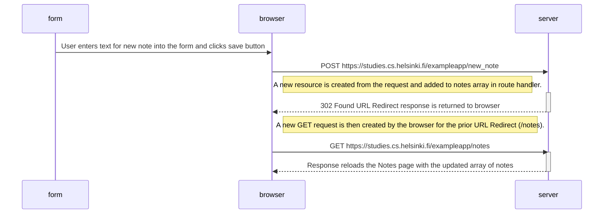

<!-- Uses the Mermaid tool. -->

```mermaid

sequenceDiagram
    participant form
    participant browser
    participant server

    form->>browser: User enters text for new note into the form and clicks save button

    browser->>server: POST https://studies.cs.helsinki.fi/exampleapp/new_note

    Note right of browser: A new resource is created from the request and added to notes array in route handler.

    activate server
    server-->>browser: 302 Found URL Redirect response is returned to browser
    deactivate server

    Note right of browser: A new GET request is then created by the browser for the prior URL Redirect (/notes).

    browser->>server: GET https://studies.cs.helsinki.fi/exampleapp/notes
    activate server
    server-->>browser: Response reloads the Notes page with the updated array of notes
    deactivate server

```
