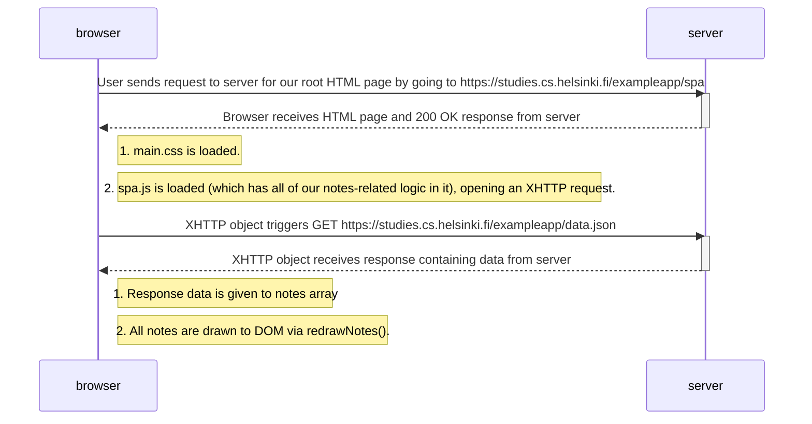

<!-- Uses the Mermaid tool. -->

```mermaid

sequenceDiagram
    participant browser
    participant server

    browser->>server: User sends request to server for our root HTML page by going to https://studies.cs.helsinki.fi/exampleapp/spa

    activate server
    server-->>browser: Browser receives HTML page and 200 OK response from server
    deactivate server

    Note right of browser: 1. main.css is loaded.
    Note right of browser: 2. spa.js is loaded (which has all of our notes-related logic in it), opening an XHTTP request.

    browser->>server: XHTTP object triggers GET https://studies.cs.helsinki.fi/exampleapp/data.json

    activate server
    server-->>browser: XHTTP object receives response containing data from server
    deactivate server

    Note right of browser: 1. Response data is given to notes array
    Note right of browser: 2. All notes are drawn to DOM via redrawNotes().

```
