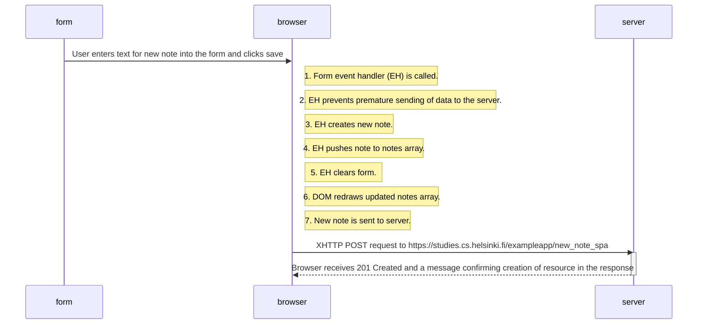

<!-- Uses the Mermaid tool. -->

```mermaid

sequenceDiagram
    participant form
    participant browser
    participant server

    form->>browser: User enters text for new note into the form and clicks save

    Note right of browser: 1. Form event handler (EH) is called.
    Note right of browser: 2. EH prevents premature sending of data to the server.
    Note right of browser: 3. EH creates new note.
    Note right of browser: 4. EH pushes note to notes array.
    Note right of browser: 5. EH clears form.
    Note right of browser: 6. DOM redraws updated notes array.
    Note right of browser: 7. New note is sent to server.

    browser->>server: XHTTP POST request to https://studies.cs.helsinki.fi/exampleapp/new_note_spa

    activate server
    server-->>browser: Browser receives 201 Created and a message confirming creation of resource in the response
    deactivate server

```
